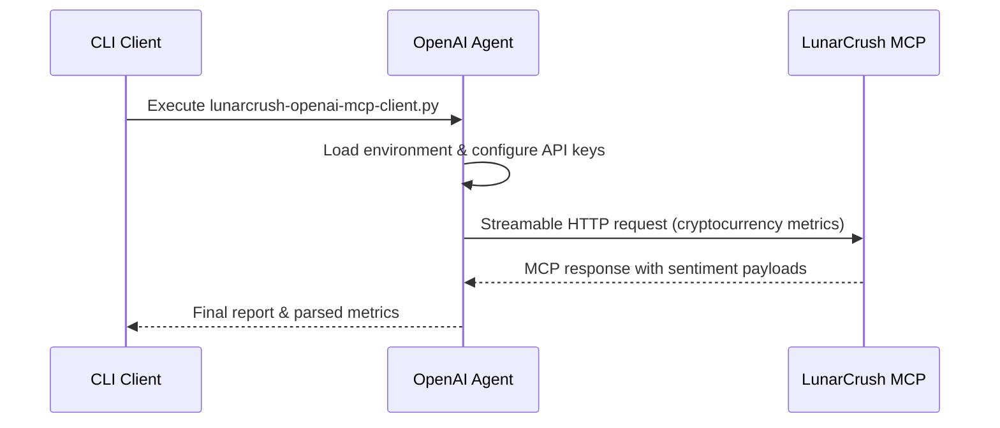

# openai-mcp-lunarcrush

## Objective
Demonstrate how to connect the OpenAI Agents SDK to the LunarCrush MCP server and surface cryptocurrency sentiment insights through an automated agent run.

## Prerequisites
- LunarCrush account and MCP access  
  - https://lunarcrush.com  
  - https://docs.lunarcrush.com/reference/mcp-getting-started
- Active OpenAI API subscription (pay-as-you-go or enterprise)  
  - https://platform.openai.com/docs/guides/billing/metered-billing

## Dependencies
- OpenAI Agents SDK: https://github.com/openai/openai-agents-python

## How to Run
1. Install Poetry 2.x if you have not already.
2. Install project dependencies: `poetry install`
3. Copy `.env.example` to `.env.local` and fill in the required values:
   - `OPENAI_API_KEY`
   - `MCP_SERVER_URL`
4. (Optional) Add any other secrets to `.env.local`; the script will also read from `.env` if present.
5. Execute the agent: `poetry run python lunarcrush-openai-mcp-client.py`

## Sample Input and Output
The script sends a single prompt asking for top cryptocurrencies gaining social momentum.

```bash
$ poetry run python lunarcrush-openai-mcp-client.py

--- Attempt 1/1 ---

=== LLM SUMMARY ===
Top tokens by rising social sentiment include BTC, ETH, and SOL...

=== PARSED METRICS ===
Sentiment: 0.62, Galaxy Score: 68.5, AltRank: 33
Sentiment: 0.58, Galaxy Score: 70.1, AltRank: 41

Query time: 9.42 s
```

## Flow Diagram


## Outstanding
- MCP server still enforces a 5 s request timeout by default; extending the timeout in `extend_mcp_timeout.py` is a temporary workaround while waiting for native server-side configuration.
