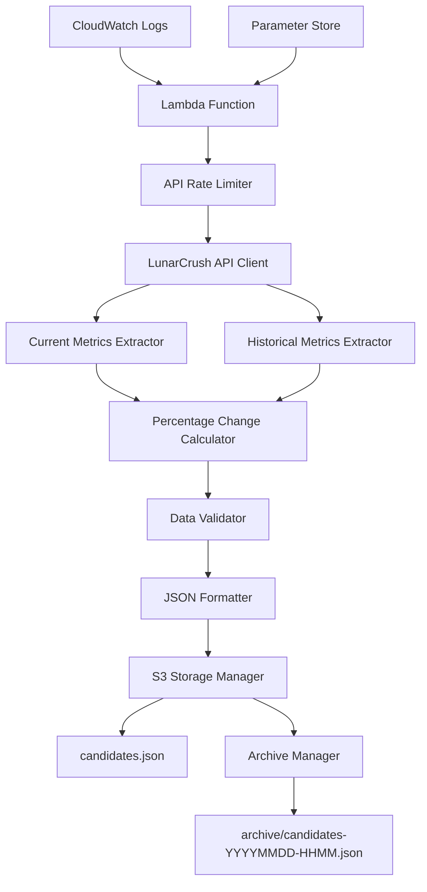

# US-001 Technical Research Document: Extract Social Metrics

## Executive Summary

This document provides comprehensive technical research for implementing US-001 Extract Social Metrics user story. The implementation will extract key social metrics from LunarCrush API for cryptocurrency assets, calculate 24-hour percentage changes, and store results in AWS S3 via Lambda function deployment.

## 1. API Research Section

### 1.1 Endpoint Details

#### Primary Endpoints
1. **Current Metrics**: `GET https://lunarcrush.com/api4/public/coins/list/v2`
   - Purpose: Retrieve current social metrics for multiple cryptocurrencies
   - Parameters: sort, filter, limit, desc, page
   - Response format: JSON with data array containing coin objects

2. **Historical Metrics**: `GET https://lunarcrush.com/api4/public/coins/{coin}/time-series/v2`
   - Purpose: Retrieve historical time series data for percentage change calculations
   - Parameters: coin (symbol or ID), bucket, interval, start, end
   - Response format: JSON with config object and data array

#### Authentication
- **Method**: Bearer Token Authentication
- **Header**: `Authorization: Bearer <API_KEY>`
- **API Key Source**: Environment variables (LUNARCRUSH_API_KEY)
- **Security**: Encrypted storage in AWS Parameter Store

#### Rate Limiting
- **Plan Limit**: 500 requests/day ($30/month plan)
- **Implementation**: Application-level throttling
- **Strategy**: Request queue with exponential backoff
- **Monitoring**: CloudWatch metrics for API usage tracking

### 1.2 Field Extraction Mappings

| Domain Field | API Field Path | Source Endpoint | Data Type |
|--------------|----------------|-----------------|------------|
| interactions_24h | data[].interactions_24h | /coins/list/v2 | Integer |
| social_volume_24h | data[].social_volume_24h | /coins/list/v2 | Integer |
| social_dominance | data[].social_dominance | /coins/list/v2 | Float |
| galaxy_score | data[].galaxy_score | /coins/list/v2 | Float |
| galaxy_score_previous | data[].galaxy_score_previous | /coins/list/v2 | Float |
| sentiment | data[].sentiment | /coins/list/v2 | Integer |
| alt_rank | data[].alt_rank | /coins/list/v2 | Integer |
| alt_rank_previous | data[].alt_rank_previous | /coins/list/v2 | Integer |
| historical_interactions | data[].interactions | /time-series/v2 | Integer |
| historical_posts_active | data[].posts_active | /time-series/v2 | Integer |
| historical_sentiment | data[].sentiment | /time-series/v2 | Integer |
| historical_social_dominance | data[].social_dominance | /time-series/v2 | Float |

### 1.3 Response Format Examples

#### Current Metrics Response
```json
{
  "config": {
    "sort": "market_cap_rank",
    "desc": true,
    "limit": 0,
    "page": 0,
    "total_rows": 7515,
    "generated": 1760647722
  },
  "data": [
    {
      "id": 1,
      "symbol": "BTC",
      "name": "Bitcoin",
      "interactions_24h": 183243410,
      "social_volume_24h": 353615,
      "social_dominance": 35.51064470777264,
      "galaxy_score": 40.5,
      "galaxy_score_previous": 43,
      "sentiment": 75,
      "alt_rank": 321,
      "alt_rank_previous": 184
    }
  ]
}
```

#### Historical Time Series Response
```json
{
  "config": {
    "coin": "2",
    "topic": "ethereum",
    "id": "coins:2",
    "name": "Ethereum",
    "symbol": "ETH",
    "interval": "1w",
    "start": 1759968000,
    "end": 1760654923,
    "bucket": "hour",
    "metrics": [],
    "generated": 1760647723
  },
  "data": [
    {
      "time": 1759968000,
      "contributors_active": 11287,
      "contributors_created": 458,
      "interactions": 1119245,
      "posts_active": 19827,
      "posts_created": 659,
      "sentiment": 82,
      "spam": 263,
      "alt_rank": 192,
      "circulating_supply": 120702112,
      "close": 4516.9,
      "galaxy_score": 49,
      "high": 4516.9,
      "low": 4513.99,
      "market_cap": 545595967799,
      "market_dominance": 12.9078,
      "open": 4516.9,
      "social_dominance": 9.5436,
      "volume_24h": 39542478282
    }
  ]
}
```

## 2. Technical Architecture Section

### 2.1 System Design



### 2.2 Component Interactions

#### Lambda Function Handler
- **Trigger**: Scheduled (CloudWatch Events) + Manual invocation
- **Runtime**: Python 3.13 (Custom Runtime)
- **Memory**: 512MB minimum
- **Timeout**: 5 minutes
- **Environment Variables**: API keys, S3 bucket name, configuration

#### API Client Module
- **Authentication**: Bearer token from Parameter Store
- **Retry Logic**: Exponential backoff with jitter
- **Rate Limiting**: Token bucket algorithm
- **Error Handling**: Structured exception handling

#### Data Processing Pipeline
1. Extract current metrics from /coins/list/v2
2. Extract historical data from /coins/{symbol}/time-series/v2
3. Calculate percentage changes using specified formulas
4. Validate data ranges and completeness
5. Format output JSON structure
6. Archive previous results
7. Store new candidates.json

### 2.3 Technology Stack

| Component | Technology | Version | Purpose |
|-----------|-------------|----------|---------|
| Runtime | Python | 3.13 | Lambda execution environment |
| HTTP Client | requests | 2.31.0+ | API communication |
| JSON Processing | json | Built-in | Data serialization |
| AWS SDK | boto3 | 1.34.0+ | AWS service integration |
| Logging | structlog | 23.1.0+ | Structured logging |
| Testing | pytest | 7.4.0+ | Unit and integration tests |
| Containerization | Docker | 24.0+ | Local development |

## 3. Implementation Considerations Section

### 3.1 Risk Assessment and Mitigation

#### High-Risk Areas
1. **API Rate Limit Exceeded**
   - **Probability**: Medium
   - **Impact**: High
   - **Mitigation**: Application-level throttling with token bucket algorithm
   - **Monitoring**: CloudWatch metrics for API usage

2. **Incomplete Historical Data**
   - **Probability**: Medium
   - **Impact**: Medium
   - **Mitigation**: Extended time range queries with data validation
   - **Fallback**: Use available data points with interpolation

3. **Lambda Timeout**
   - **Probability**: Low
   - **Impact**: Medium
   - **Mitigation**: Optimized API calls with parallel processing
   - **Monitoring**: CloudWatch timeout alerts

#### Medium-Risk Areas
1. **API Response Format Changes**
   - **Mitigation**: Schema validation with graceful degradation
   - **Monitoring**: Response format validation alerts

2. **Credential Exposure**
   - **Mitigation**: Encrypted Parameter Store storage
   - **Monitoring**: CloudTrail access logging

### 3.2 Performance Optimization

#### API Request Optimization
- **Batch Processing**: Multiple symbols per request
- **Parallel Execution**: Concurrent API calls with asyncio
- **Caching Strategy**: Previous values from S3 (no caching requirement)
- **Connection Reuse**: HTTP session pooling

#### Lambda Optimization
- **Cold Start Reduction**: Provisioned concurrency for scheduled runs
- **Memory Management**: Efficient data structures
- **Package Optimization**: Lambda layers for dependencies

### 3.3 Security Best Practices

#### API Security
- **Credential Management**: AWS Systems Manager Parameter Store
- **Encryption**: KMS-encrypted parameters
- **Access Control**: Least-privilege IAM roles
- **Audit Logging**: CloudTrail integration

#### Data Security
- **Transit Encryption**: HTTPS/TLS 1.3
- **At Rest Encryption**: S3 SSE-S3
- **Network Security**: VPC endpoint for S3 access
- **Secrets Rotation**: Automated credential rotation

### 3.4 Testing Strategies

#### Unit Testing
- **API Client Mock**: Mock responses for all endpoints
- **Calculation Logic**: Test percentage change formulas
- **Data Validation**: Test edge cases and error conditions
- **JSON Formatting**: Validate output structure

#### Integration Testing
- **API Integration**: Test against LunarCrush test endpoints
- **S3 Integration**: Test file upload and archiving
- **Lambda Integration**: End-to-end workflow testing
- **Error Scenarios**: Test failure modes and recovery

#### Performance Testing
- **Load Testing**: Simulate high-volume symbol processing
- **Timeout Testing**: Validate Lambda timeout handling
- **Rate Limit Testing**: Verify throttling behavior
- **Memory Testing**: Monitor Lambda memory usage

## 4. Data Processing Specifications

### 4.1 Percentage Change Calculations

| Metric | Formula | Edge Case Handling |
|---------|----------|-------------------|
| interactions_24h | ((current - previous_24h) / previous_24h) * 100 | If previous_24h = 0, change = current |
| social_volume_24h | ((current_posts_active - previous_24h_posts_active) / previous_24h_posts_active) * 100 | If previous_posts_active = 0, change = current_posts_active |
| social_dominance | ((current_dominance - previous_24h_dominance) / previous_24h_dominance) * 100 | If previous_dominance = 0, change = current_dominance |
| galaxy_score | galaxy_score - galaxy_score_previous | Direct subtraction |
| sentiment | ((current_sentiment - previous_24h_sentiment) / previous_24h_sentiment) * 100 | If previous_sentiment = 0, change = current_sentiment |
| alt_rank | alt_rank_previous - alt_rank | Direct subtraction (lower is better) |

### 4.2 File Management Strategy

#### Current Output Structure
```json
{
  "generated_timestamp": "2025-11-09T16:00:00Z",
  "metrics": [
    {
      "symbol": "BTC",
      "name": "Bitcoin",
      "current": {
        "interactions_24h": 183243410,
        "social_volume_24h": 353615,
        "social_dominance": 35.51,
        "galaxy_score": 40.5,
        "sentiment": 75,
        "alt_rank": 321
      },
      "changes": {
        "interactions_24h_pct": 12.5,
        "social_volume_24h_pct": 8.3,
        "social_dominance_pct": -2.1,
        "galaxy_score_change": -2.5,
        "sentiment_pct": 5.2,
        "alt_rank_change": 15
      }
    }
  ]
}
```

#### Archive Strategy
- **Current File**: `candidates.json` in S3 bucket root
- **Archive Pattern**: `archive/candidates-YYYYMMDD-HHMM.json`
- **Retention**: 7 days for current files, 30 days for archives
- **Cleanup**: Automated lifecycle policies for old archives

## 5. Deployment Configuration

### 5.1 AWS Lambda Configuration

#### Function Settings
- **Runtime**: Python 3.13 (Custom Runtime)
- **Handler**: `lambda_function.lambda_handler`
- **Memory**: 512 MB (configurable)
- **Timeout**: 300 seconds (5 minutes)
- **Environment Variables**:
  - `LUNARCRUSH_API_KEY`: Encrypted parameter reference
  - `S3_BUCKET_NAME`: Target bucket name
  - `LOG_LEVEL`: INFO/DEBUG/ERROR
  - `SYMBOLS_LIST`: Comma-separated cryptocurrency symbols

#### IAM Role Permissions
```json
{
  "Version": "2012-10-17",
  "Statement": [
    {
      "Effect": "Allow",
      "Action": [
        "s3:GetObject",
        "s3:PutObject",
        "s3:DeleteObject",
        "s3:ListBucket"
      ],
      "Resource": "arn:aws:s3:::bucket-name/*"
    },
    {
      "Effect": "Allow",
      "Action": [
        "ssm:GetParameter",
        "ssm:GetParametersByPath"
      ],
      "Resource": "arn:aws:ssm:region:account:parameter/lunarcrush/*"
    },
    {
      "Effect": "Allow",
      "Action": [
        "logs:CreateLogGroup",
        "logs:CreateLogStream",
        "logs:PutLogEvents"
      ],
      "Resource": "arn:aws:logs:region:account:log-group:/aws/lambda/function-name"
    }
  ]
}
```

### 5.2 Local Development Setup

#### Docker Configuration
```dockerfile
FROM public.ecr.aws/lambda/python:3.13

COPY requirements.txt .
RUN pip install -r requirements.txt

COPY lambda_function.py ${LAMBDA_TASK_ROOT}
CMD [ "lambda_function.lambda_handler" ]
```

#### Docker Compose
```yaml
version: '3.8'
services:
  lambda:
    build: .
    environment:
      - LUNARCRUSH_API_KEY=${LUNARCRUSH_API_KEY}
      - S3_BUCKET_NAME=local-test-bucket
    volumes:
      - ./local:/var/task
    ports:
      - "9000:8080"
  
  localstack:
    image: localstack/localstack
    ports:
      - "4566:4566"
    environment:
      - SERVICES=s3
      - DEBUG=1
```

## 6. Monitoring and Observability

### 6.1 Structured Logging
```python
import structlog

logger = structlog.get_logger()

def lambda_handler(event, context):
    logger.info("Function started", 
               function_name=context.function_name,
               request_id=context.aws_request_id)
    
    try:
        # Business logic
        logger.info("Processing completed", 
                   symbols_processed=len(symbols),
                   api_requests_made=request_count)
    except Exception as e:
        logger.error("Processing failed", 
                    error=str(e),
                    error_type=type(e).__name__)
        raise
```

### 6.2 CloudWatch Metrics
- **Custom Metrics**: API requests, processing time, error rates
- **Standard Metrics**: Lambda invocations, duration, errors
- **Alarms**: High error rates, approaching rate limits

## 7. Implementation Roadmap

### Phase 1: Core Functionality (Week 1)
1. API client implementation with authentication
2. Basic data extraction from current metrics endpoint
3. Simple percentage change calculations
4. Basic S3 file output

### Phase 2: Robust Implementation (Week 2)
1. Historical data extraction
2. Advanced error handling and retry logic
3. Rate limiting implementation
4. File archiving strategy

### Phase 3: Production Readiness (Week 3)
1. Comprehensive testing suite
2. Lambda deployment configuration
3. Monitoring and alerting setup
4. Documentation and runbooks

## 8. Conclusion

This technical research provides a comprehensive foundation for implementing US-001 Extract Social Metrics. The architecture balances performance, reliability, and security while meeting all functional requirements specified in the user story. The phased implementation approach allows for iterative development and testing.

Key success factors:
1. Proper API rate limiting to stay within plan limits
2. Accurate percentage change calculations with edge case handling
3. Reliable file management and archiving strategy
4. Comprehensive monitoring and observability
5. Security best practices throughout the implementation

The implementation will provide a solid foundation for the broader cryptocurrency trading system while maintaining flexibility for future enhancements.